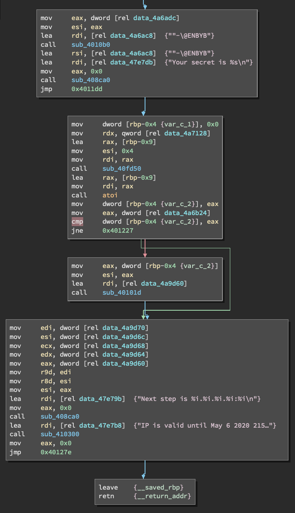
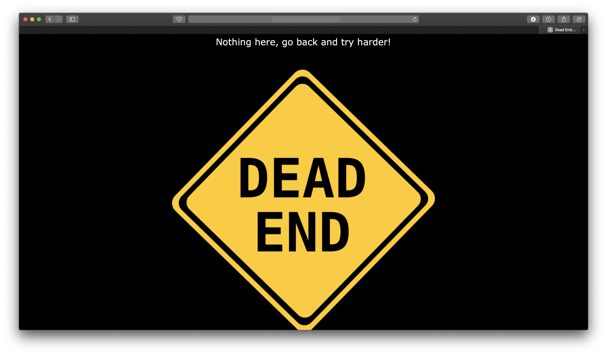
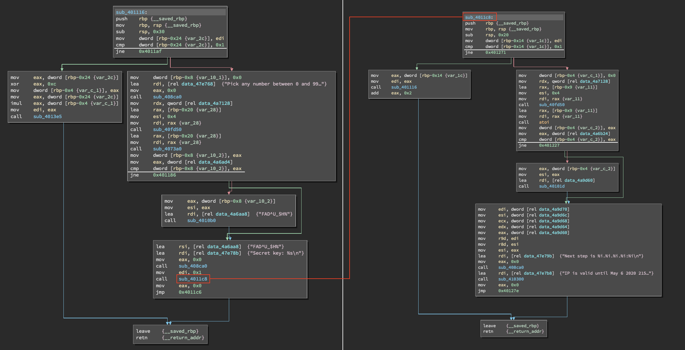

# PVKuvahaaste2020 

On 17.4. the Finnish Defence Forces tweeted a [challenge](https://twitter.com/Puolustusvoimat/status/1251139182111739904)  related to a recruitment process which contained a QR-code.
My friend [@JaanTaponen](https://www.github.com/JaanTaponen) sent me a link to this tweet and I was curious to see what the QR-code would contain. I've been interested in CTF-type challenges and reverse engineering for a long time but this was the first time I actually attempted solving one.

## The QR-code


A quick scan revealed an encrypted string:
```
HFCUKQKENFPF4SCIJBOUOMR5IU5EAPJ5GZOTOOS6G45FY5LYLY5D2PSAHJCUMRDOHI2WYYLGLRQWQZ24MFPWCXYKBI4UKRKBNFPF4YDFMROWCYK5MBSV2YDHM5PECRZZGI6EMOJSGJCEKNTBL5QV6XJTHI7QUCRHYOSEISSFJJCDSSWDWY6DZQ5EJJCELQ5EEBLTGQ2GIU3FYN2AIM2DMWBAGY5CARJSINDTURJSEA3DUPGDUQQEIMRSEBCTMOJVYOSCAPR2IRCMHJGDUQ7SARZSHI4TMNSEIQZF2CQK
```

I started to fiddle around with the string using [CyberChef](https://gchq.github.io/CyberChef) and quickly found out that it was encrypted first with `ROT47` and then with `Base32`. I also checked if the image contained any metadata but it didn't.
After decrypting, the string contained two links; one to a job advertisement, and one to a mysterious binary file named `pvhakuhaaste2020.bin` with a message roughly translating to `A brute-force attack is not needed or allowed at any point`. At this point I knew I was going to dive straight into the deep end with this challenge.

## The binary file

And so I downloaded the binary file and took a look into the hexdump which didn't really give any insight since the file was over half a megabyte in size. I inspected the cleartext strings contained in the file and it appeared to be a puzzle.
```
$ strings pvhakuhaaste2020.bin

[...]
Pick any number between 0 and 99: 
Secret key: %s
Next step is %i.%i.%i.%i:%i
IP is valid until May 6 2020 2159Z
Your secret is %s
%s %s
%02x
Valid until May 6 2020 2159Z
Is this correct path?: 
Bye..
[...]
```
I then tried to execute it and sure enough, I was greeted with a message:
```
$ ./pvhakuhaaste2020.bin

Valid until May 6 2020 2159Z
Is this correct path?:
```
I attempted to enter a random string and the program just exitted with a message `Bye..`.
I then loaded the file into `gdb`, the GNU Project Debugger and also downloaded a program called [Binary Ninja](www.binary.ninja). This was my first time using either of these tools. I knew the basic principles of assembly languages, computer memory and registers, but hadn't inspected actual program's working logic based only on reading Intel x86-64 assembler instructions. I played around for a moment with gdb, but by itself it didn't reveal aynthing useful since the binary file didn't contain any debugging symbols. I tried to take a look at the functions, but found nothing useful:


With a brief introduction of watching a related video by [@LiveOverflow](https://www.github.com/LiveOverflow) I loaded up Binary Ninja and started to break down this programs contents and execution piece by piece. At first this seemed like a tedious task since the binary file consisted of hundreds of arbitrarily named functions, but eventually I found the bits that actually matter. First I looked into the part where the user input is asked:


It seemed like it takes a input string, saves it to register `$rax` or `$rbp-0x16`, XOR's first five characters with something, puts it through a fairly complicated function and checks if the result's lower 8 bits equal to `0x38`. In Intel x86-64 assembly language registers can be handled in different bit lengths. In the case of 64-bit-sized `$rax`, it's lower 32 bits can be accessed from `$eax` and lowest 8 bits from `$al`. I found out that at least after scrambling, the original input string was located from `$rbp-0x16` onwards and the result was in `$rax`.

At first I tried to think through the logic of transforming the input string to find out what the right key is, but after a while I decided to set a breakpoint at the address `0x401744`, the point where comparison is executed, and using `gdb` changed the value of `$eax` manually. This approach was successful and I got the first secret key (which by the way was not the one shown in the screenshot but similar). I also got an IP-address which got me very excited thinking I had succeeded at this challenge.



I took a visit to the IP-address I got and was immediately brought back down to earth.



And so I had to dive back into the code and find some other clues. Next, I started to look at another branch of the code which seemed interesting. It could be accessed if the value of `$eax` was zero after it was shuffled around.



This part was fairly simple. All I had to do was to set a couple of breakpoints where there was `cmp` calls to navigate my way through the right branches. I got a second secret key and found an another IP-address. It had a port suffix `:82` which was odd. The IP-address didn't respond with a web browser, but still pinged back. My first thought was that it had something to do with FTP or something similar. It turned out FTP uses port 21, but running a port scan it indeed was open. At this point [@JaanTaponen](https://www.github.com/JaanTaponen) wanted to join me on my adventure and started to look deeper into the mysterious IP-address while I focused more on debugging rest of the branches to find more information.

UNDER CONSTRUCTION

## The decoy (written by [@JaanTaponen](https://www.github.com/JaanTaponen))

I started getting interested when [@immonel](https://www.github.com/immonel) had found this address ```106.250.xx.xxx:82``` which didn't point to anything with a regular web browser. After some searching we found [this](https://www.speedguide.net/port.php?port=82) that specified that this particular port had been used for.

* some kind of tor tool
* xfer
* 10 years old Win32 Trojan

We first tried to visit the page with a Tor browser without any response. The aspect of Tor makes it really hard to trace, so Wireshark inspection was really tedious so we gave up.

#### nmap

A quick nmap scan reveladed that server didn't have much running with TCP. Only the port 21 was interesting. Connecting to it with anonymous ftp obviously didn't work at all. 
```
Host is up (0.35s latency).
Not shown: 994 closed ports
PORT    STATE    SERVICE
21/tcp  open     ftp
23/tcp  filtered telnet
25/tcp  filtered smtp
135/tcp filtered msrpc
139/tcp filtered netbios-ssn
445/tcp filtered microsoft-ds

Nmap done: 1 IP address (1 host up) scanned in 49.97 seconds****
```
The reason was quite obvious, a deeper scan for the service banners reveled that the ```port 21``` *may* have had some kind of firewall running or nmap didin't understand what it was talking to. Inspecting the TCP protocol exchange more deeply didn't reveal anything either. The server just disconnected after the first handshake attempt, so even sending packets with Netcat wouldn't work.

```
21/tcp  open     tcpwrapped
```

The original ```port 82``` didin't have anything interesting running either.
```
Host is up (0.34s latency).

PORT   STATE  SERVICE
82/tcp closed xfer

Nmap done: 1 IP address (1 host up) scanned in 1.81 second
```
I experimented with this [xfer](https://docs.ipswitch.com/MOVEit/DMZ90/FreelyXfer/MOVEitXferManual.html) utility, but a closer inspection at the source code revealed that it was just a fancy file transfer wrapper that was really old. Xfer clients seemed to have disappeared from the face of the earth around 10 years ago.

#### Trojan thoughts

I wasted a lot of time digging through what xfer was and finding any tools that could use said protocol without any luck. I came to the conclusion that if this was the correct server then we would need some additional information or we would need to exploit some kind of old vurnerability which the port 82 reference could point to. I could have written a small .exe and try to send it via netcat to get the server ping to one of my PfSense firewalls. 

In the end my theory was proven to be very false or then PV really is playing some 4D chess.

UNDER CONSTRUCTION

## The real IP

TODO

We landed on the real page that look something like this:


From know on you can guess that challenge was almost done. We wrote a very simple Python script which grabs the key and tries to POST with all the secrets we found one by one.

### Python script to solve the puzzle

```
import requests
from bs4 import BeautifulSoup

url = "http://104.248.xx.xxx"

page = requests.request("GET", url)
soup = BeautifulSoup(page.content, 'html.parser')

key = soup.p.b.get_text()

secrets = [
    '[OBFUSCATED]',
    '[OBFUSCATED]',
    '[OBFUSCATED]',
    '[OBFUSCATED]',
    '[OBFUSCATED]',
    '[OBFUSCATED]',
    '[OBFUSCATED]'
    ]

for secret in secrets:
    headers = {}
    payload = {'key':key, 'secret':secret}
    print(requests.post(url, headers = headers, data = payload).text.encode('utf8'))
```

First we pull the secret from the original page with ```GET``` and then iterate through the found secrets with the given instructions. So that would be ```POST``` with the secret, key data values. 

After that we got the output (each line represents a try with one of the keys):

```bash
python3 solver.py
CORRECT! This is the end of the challenge. Write this string -> BRUH <- down, we might ask it.
ERROR
ERROR
ERROR
ERROR
ERROR
Try harder      // This was the hex information we got
```

The ```ERROR``` prints just tell that there was ony one correct key for the post URL in the whole binary.
